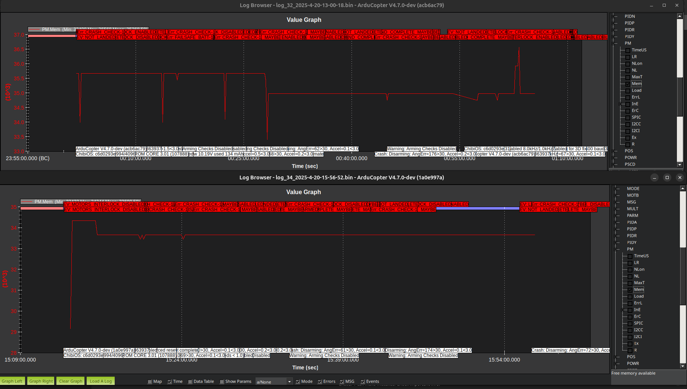
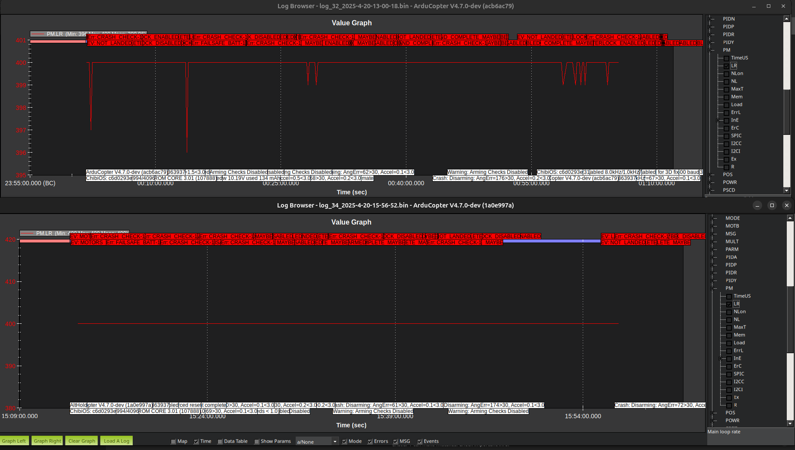
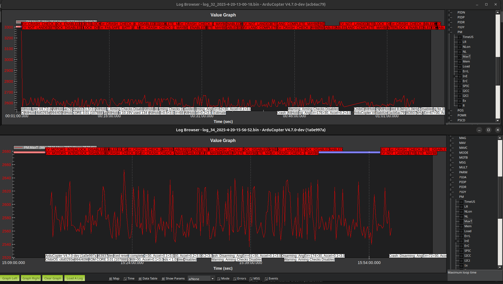
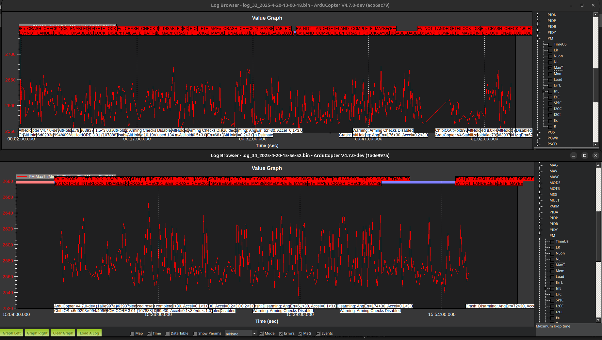
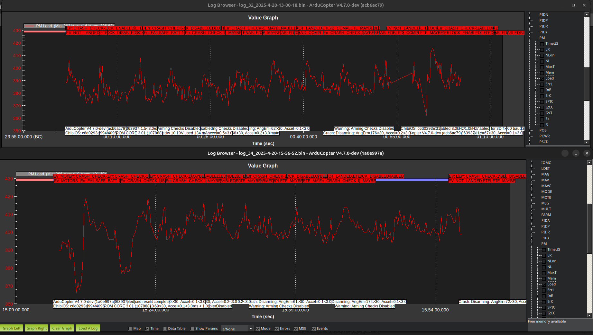

# log analysis 

This directory has the log analysis (just using MissionPlanner) I did comparing some of the encrypted/unencrypted dataflash logs in the performance monitoring section: https://ardupilot.org/planner/docs/common-downloading-and-analyzing-data-logs-in-mission-planner.html 

The images on top are from the ardupilot version that is using encryption and the bottom is from regular ardupilot built off main. 
## Mem

Free memory in kb, it seems to be around the same for both of them. 

## Main loop rate

This probably means there are some errors or something going wrong since it should be at 400 for both consistently. 

## Max loop time

I have a zoomed out picture in the first one and then below it is zoomed in to show a comparison after that first initial long loop. 

## load

Percentage (times 10) of the scheduler loop period when CPU is used 