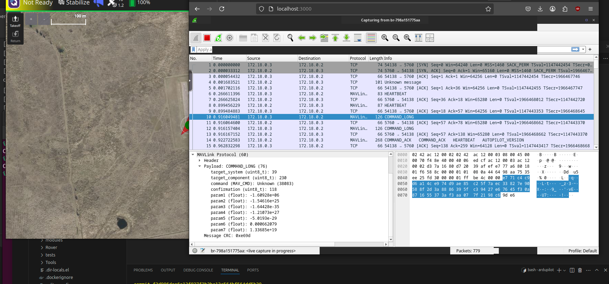

# Using the docker compose

## Starting out
Run `docker compose up --build` 

After everything is up you should see qgroundcontrol in the foreground. In a terminal run the below command:

`docker exec -it qgcappimagetest nc -vz ardupilot 5760`

and you should see an output like: 

```
Connection to ardupilot (172.18.0.2) 5760 port [tcp/*] succeeded!
```

Now in the qgroundcontrol screen connect to TCP and use that ip address with port 5760. 

## Using wireshark 

Go to `localhost:3000` on your host machine and click on the network that is prepended by `br-`, this should be the docker network bridge and you should now be good and start seeing traffic. The goal of this is to see that there is now encryption and commands will look like below in the wireshark interface, so encryption is working! 

